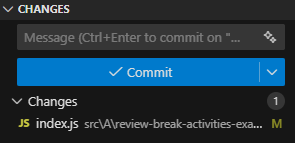
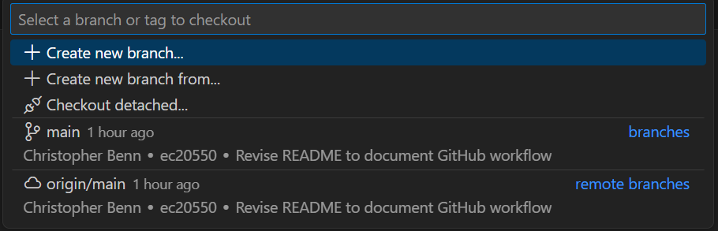

# Github Workflow

This file outlines the workflow to use when working on the project.
You are to follow this workflow at all times.

## Workflow Outline
When working, follow the following process:

> Pull → Work on Project → Stage + Commit Changes → Push to Branch

### Pulling

When you first start, pull all new changes from other teamates. This will help avoid potential merge conflicts, and keep you up to date on any new content.

This can be done in VSCode by pressing the following button:


or in terminal with the following commands:

```
git pull
git pull <remote> <branch>
```

### Staging Changes

When you make changes, to update them for the rest of the team you first need to stage the changes.

```
git add <file_name>
git add . 
```

### Commiting Changes

Once your changes have been staged, you then need to commit those changes. This will make your work visible to everyone working in your branch, allowing them to pull your changes.

You must provide a sufficient message on what changes you have made. 

VSCode will automatically stage all changes if none are specified. 



If you are using terminal, use the following commands

```
git commit
git commit -m "Commit Message"
```

### Pushing

When you have made significant changes, or have finished for the day, push your changes. It is important for other members to be up to date on your changes as well.

This can be done in VSCode by pressing the following button:


or in terminal with the following commands:
```
git push
git push <remote> <branch>
```

## Working with Main

While working on the main branch is discouraged, you may do so when initializing the project, or when making small or last minute changes. All other work should be done on a branch.

To see what branch you are on, look for this in VSCode: 


Or use the following commands: 
```
git branch
```

## Working with Branches
When working with branches, you must be able to create, switch, and merge branches.

All functions can be seen in the following VSCode Menu



### Creating Branches

To create a branch, use the create branch button, or the following terminal command:
```
git branch <branch-name>
```

### Switching Branches

To swtich from one branch to another use the following VSCode Button: 


Or use the following command: 

```
git switch <branch-name>
```

### Merging Branches

Once sufficient work is done on your branch, such as finishing a section, you must merge the branch to the main. To do this, follow the following VSCode images.

Or use the following terminal commands. Make sure to first switch to the main branch. Then merge the name of an existing branch.

```
git merge <branch-name>
```

### Merge Conflicts

If there is a conflict between the current file and the commited file, you may have to resolve a merge conflict. When one occurs, look through and change the files so that there are no errors.

