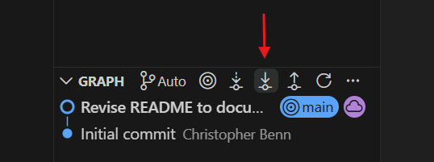
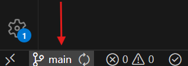

# Github Workflow

This site outlines the workflow to use when working on the project.
You are to follow this workflow at all times.

## Workflow Outline
When working, follow the following process:

> Pull → Work on Project → Push to Branch

### Pulling

When you first start, pull all new changes from other teamates. This will help avoid potential merge conflicts, and keep you up to date on any new content.

This can be done in VSCode by pressing the following button:



or in terminal with the following commands:

```
git pull
git pull <remote> <branch>
```


### Pushing

When you have made significant changes, or have finished for the day, push your changes. It is important for other members to be up to date on your changes as well.

This can be done in VSCode by pressing the following button:


or in terminal with the following commands:
```
git push
git push <remote> <branch>
```

## Working with Main

While working on the main branch is discouraged, you may do so when initializing the project, or when making small or last minute changes. All other work should be done on a branch.

To see what branch you are on, look for this in VSCode: 



Or use the following commands: 
```
git branch
```

## Working with Branches
When working with branches, you must be able to create, switch, and merge branches.

All functions can be seen in the following VSCode Menu


### Creating Branches

To create a branch

### Switching Branches

### Merging Branches

